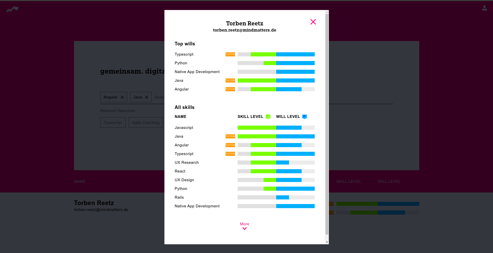

This fork of SinnerSchrader's [SkillWill](https://github.com/sinnerschrader/SkillWill) is intended to adapt it to the needs of [mindmatters](https://mindmatters.de). The necessary changes include:
* removing dependencies to external infrastrucure (except Google Loing APIs)
* applying custom stylesheets to match mindmatters' CD
* removing the admin role: every user is allowed to make global changes
* removing the ability to hide skills (as this added complexity without being useful...)

# What exactly is SkillWill?

SkillWill is a simple tool to track what people know (their skills) and what people want to do (their wills).
Every user can define their personal levels of interest and knowledge for each skill in the system; anyone can search for persons by those skills, e.g.
* You want somebody to teach you programming language x? → Search for x and see who can help.
* You're a project manager and need somebody who can do x? → Search x foobar and you get a list of candidates.
* You want to get better at x? → Show your interest for x and people who need some to do x will find you.
* ...

# Building with Docker
* run `docker-compose up --build`
* the application starts on port 8080

See `frontend/README.md`/`backend/README.md` for more information on how to build the respective subproject.

# Important URLs
* `/`: Application main view
* `/swagger`: Interactive API documentation
* `/actuator/info`: Show application-specific stats (# of users, skills per user, etc.)

# License
* [MIT](https://opensource.org/licenses/MIT) (see LICENSE.md)
